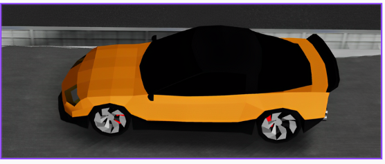
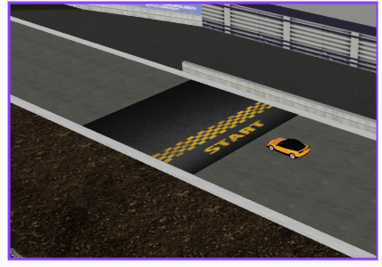

# 🚗🏁 CarRacing 🏁🚗

**CarRacing** is a thrilling 3D car racing game built using **[ReactJS][React-url]**, **[Three.js][Three-url]**, and **[CannonJS][Cannon-url]**. Race against time and enjoy an immersive experience with realistic physics and dynamic camera views!

<div display='grid' grid-template-columns: repeat(2, 1fr); grid-gap: 10px;>
   
   
</div>

# 📸 Video

# Table of Contents

- [🌟 Features](#-features)
- [📋 Requirements](#-requirements)
- [🛠️ Installation](#-installation)
- [🎮 Usage](#-usage)
- [🤝 Contributors](#-contributors)
- [📬 Contact](#-contact)
- [📦 Dependencies](#-dependencies)

## 🌟 Features

- **🌐 3D Graphics**: Stunning visuals powered by **[Three.js][Three-url]**.
- **💥 Physics Engine**: Realistic car physics using **[CannonJS][Cannon-url]**.
- **🎥 Camera Views**: Switch between different camera perspectives.
- **🕹️ Simple Controls**: Intuitive car controls with keyboard inputs.

## 📋 Requirements

- **[![NPM][NPM]][NPM-url]**
- [![Cannon][Cannon.js]][Cannon-url]
- [![Three.js][Three.js]][Three-url]
- [![React][React.js]][react-url]

## 🛠️ Installation

Follow these steps to install and run the project locally:

1. **Clone the repository**:
   ```bash
   git clone https://github.com/tantran24/CarRacing.git
   cd CarRacing
   ```
2. **Install the dependencies:**

   ```bash
   npm install
   ```

3. **Start the development server:**
   ```bash
   npm run dev
   ```

## 🎮 Usage

Use the following keyboard controls to play the game:

- **W**: Accelerate
- **S**: Brake/Reverse
- **A**: Steer Left
- **D**: Steer Right
- **R**: Reset Car
- **K**: Change Camera View
- **M**: Change Camera View

## 🤝 Contributors

| **Members**                                          |                        **Email**                        |
| :--------------------------------------------------- | :-----------------------------------------------------: |
| [Trần Duy Tân](https://github.com/tantran24)         | [21522576@gm.uit.edu.vn](mailto:21522576@gm.uit.edu.vn) |
| [Đinh Vũ Minh Nhật](https://github.com/NhatDinh2411) | [21522414@gm.uit.edu.vn](mailto:21522414@gm.uit.edu.vn) |
| [Đào Nam Thuận](https://github.com/daonamthuan)      | [21522649@gm.uit.edu.vn](mailto:21522649@gm.uit.edu.vn) |

## 📬 Contact

For any questions or support, please contact our team any team member's email or visit our GitHub repository.

## 📦 Dependencies

The project relies on the following dependencies:

- **[@react][React-url]**: A JavaScript library for building user interfaces.
- **[@react-spring/three](https://www.npmjs.com/package/@react-spring/three)**: React-spring bindings for three.js.

- **[@react-three/drei](https://www.npmjs.com/package/@react-three/drei)**: A growing collection of useful helpers and abstractions for react-three-fiber.
- **[@react-three/fiber](https://www.npmjs.com/package/@react-three/fiber)**: A React renderer for three.js.
- **[@react-three/postprocessing](https://www.npmjs.com/package/@react-three/postprocessing)**: Postprocessing integration for react-three-fiber.
- **[@react-three/rapier](https://www.npmjs.com/package/@react-three/rapier)**: Rapier physics engine integration for react-three-fiber.
- **[@react-three/cannon](https://www.npmjs.com/package/@react-three/cannon)**: Cannon.js physics integration for react-three-fiber.

---

## Enjoy racing! 🚗💨

[React.js]: https://img.shields.io/badge/React-20232A?style=for-the-badge&logo=react&logoColor=61DAFB
[React-url]: https://reactjs.org/
[Three.js]: https://img.shields.io/badge/-ThreeJS-049EF4?logo=threedotjs&logoColor=black&style=for-the-badge
[Three-url]: https://threejs.org/
[Cannon.js]: https://img.shields.io/badge/CannonJS-35495E?style=for-the-badge
[Cannon-url]: https://schteppe.github.io/cannon.js/
[NPM]: https://img.shields.io/badge/npm-35495E?logo=npm&style=for-the-badge
[NPM-url]: https://www.npmjs.com/
